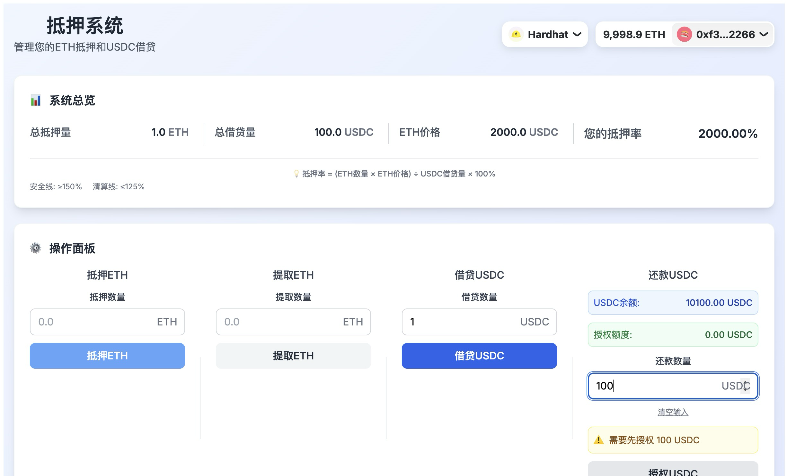

# 部署指南



## 项目简介

这是一个基于以太坊的抵押借贷系统，支持用户抵押ETH并借贷USDC。系统包含完整的抵押率计算、清算机制和用户友好的Web界面。

### 主要功能
- 🔒 ETH抵押管理
- 💰 USDC借贷功能  
- 📊 实时抵押率计算
- ⚡ 智能授权机制
- 🎨 现代化用户界面

## 步骤1: 安装依赖

### 合约依赖
```bash
cd contract
npm install
```

### 前端依赖
```bash
cd front
npm install
```

## 步骤2: 启动本地区块链

```bash
cd contract
npx hardhat node
```

这会启动一个本地的Hardhat节点，运行在 `http://127.0.0.1:8545`

## 步骤3: 部署合约

在新的终端窗口中运行：

```bash
cd contract
npx hardhat run scripts/deploy.js --network localhost
```

您会看到类似以下的输出：

```
开始部署抵押系统合约...
部署账户: 0xf39Fd6e51aad88F6F4ce6aB8827279cffFb92266
账户余额: 10000.0 ETH

部署MockUSDC合约...
MockUSDC合约地址: 0x5FbDB2315678afecb367f032d93F642f64180aa3

部署CollateralVault合约...
CollateralVault合约地址: 0xe7f1725E7734CE288F8367e1Bb143E90bb3F0512

为抵押金库添加初始流动性...
已添加 1000000 USDC作为初始流动性
已为部署者铸造 10000 USDC用于测试

部署完成！
=== 合约地址 ===
MockUSDC: 0x5FbDB2315678afecb367f032d93F642f64180aa3
CollateralVault: 0xe7f1725E7734CE288F8367e1Bb143E90bb3F0512
=== 系统参数 ===
初始ETH价格: 2000.000000 USDC
最小抵押率: 150%
清算阈值: 125%
清算惩罚: 10%
```

## 步骤4: 更新前端配置

将部署输出的合约地址更新到 `front/src/contracts/config.ts`：

```typescript
export const CONTRACT_ADDRESSES = {
  COLLATERAL_VAULT: "0xe7f1725E7734CE288F8367e1Bb143E90bb3F0512", // 替换为实际地址
  MOCK_USDC: "0x5FbDB2315678afecb367f032d93F642f64180aa3", // 替换为实际地址
};
```

## 步骤5: 启动前端应用

```bash
cd front
npm run dev
```

访问 `http://localhost:5173` 查看应用。

## 步骤6: 连接钱包

1. 在浏览器中打开应用
2. 点击"连接钱包"按钮
3. 选择MetaMask或其他Web3钱包
4. 确保连接到 `localhost:8545` 网络

## 步骤7: 测试功能

### 获取测试ETH
Hardhat节点会自动为前10个账户提供10000 ETH。

### 获取测试USDC
部署脚本已经为部署者账户铸造了10000 USDC。如果需要更多，可以使用以下命令：

```bash
cd contract
npx hardhat console --network localhost
```

在控制台中运行：
```javascript
const MockUSDC = await ethers.getContractFactory("MockUSDC");
const mockUSDC = MockUSDC.attach("YOUR_MOCK_USDC_ADDRESS");
await mockUSDC.mint("YOUR_ADDRESS", ethers.parseUnits("10000", 6));
```

## 测试流程

1. **抵押ETH**: 抵押1-2 ETH
2. **借贷USDC**: 借贷1000-2000 USDC（确保抵押率>150%）
3. **查看抵押率**: 确认抵押率显示正确
4. **还款**: 还款部分USDC
5. **提取抵押**: 提取部分ETH（确保仍满足抵押率要求）

## 常见问题

### 1. 合约部署失败
- 确保Hardhat节点正在运行
- 检查账户是否有足够的ETH
- 查看错误信息并修复

### 2. 前端无法连接
- 确保合约地址配置正确
- 检查钱包是否连接到正确的网络
- 查看浏览器控制台错误信息

### 3. 交易失败
- 检查账户余额是否足够
- 确认抵押率满足要求
- 查看合约错误信息

### 4. 依赖安装失败
```bash
# 清除缓存重新安装
rm -rf node_modules package-lock.json
npm install
```

## 运行测试

```bash
cd contract
npx hardhat test
```

测试会验证所有主要功能：
- 合约部署
- ETH抵押
- USDC借贷
- 抵押率计算
- 清算机制
- 管理员功能

## 部署到测试网

### 1. 配置环境变量
```bash
cd contract
echo "PRIVATE_KEY=your_private_key" > .env
echo "INFURA_PROJECT_ID=your_infura_project_id" >> .env
```

### 2. 更新hardhat配置
在 `hardhat.config.js` 中添加Sepolia网络配置。

### 3. 部署
```bash
npx hardhat run scripts/deploy.js --network sepolia
```

### 4. 验证合约
```bash
npx hardhat verify --network sepolia DEPLOYED_ADDRESS "constructor_arg1" "constructor_arg2"
```

## 安全注意事项

1. **私钥安全**: 永远不要将私钥提交到代码仓库
2. **测试环境**: 始终先在测试网测试
3. **代码审计**: 生产部署前进行安全审计
4. **监控**: 部署后监控合约状态和交易 # loan
